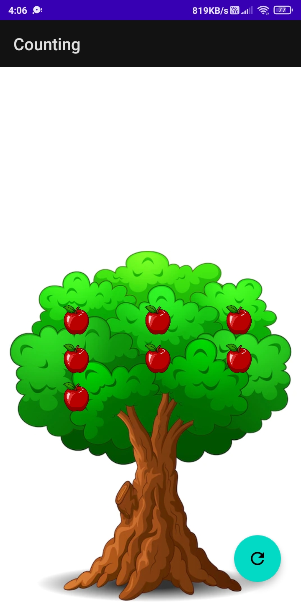
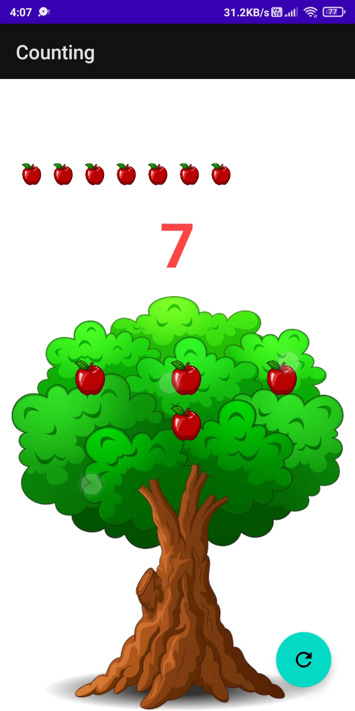

# Teach Counting easily to Mentally Disabled children

A simple application to teach counting for mentally disabled children

## Screenshots

<table style="width:100%">
  <tr>
    <th>Initial State (Before starting to count)</th>
    <th>Next State (After counting few items)</th>
  </tr>
  <tr>
    <td></td>
    <td></td>
  </tr>
</table>

## Built With 🛠
- [Kotlin](https://kotlinlang.org/) - First class and official programming language for Android development.
- [Coroutines](https://kotlinlang.org/docs/reference/coroutines-overview.html) - For asynchronous and more..
- [Flow](https://kotlin.github.io/kotlinx.coroutines/kotlinx-coroutines-core/kotlinx.coroutines.flow/-flow/) - A cold asynchronous data stream that sequentially emits values and completes normally or with an exception.
- [Android Architecture Components](https://developer.android.com/topic/libraries/architecture) - Collection of libraries that help you design robust, testable, and maintainable apps.
  - [ViewModel](https://developer.android.com/topic/libraries/architecture/viewmodel) - Stores UI-related data that isn't destroyed on UI changes.
  - [ViewBinding](https://developer.android.com/topic/libraries/view-binding) - Generates a binding class for each XML layout file present in that module and allows you to more easily write code that interacts with views.
- [Material Components for Android](https://github.com/material-components/material-components-android) - Modular and customizable Material Design UI components for Android
